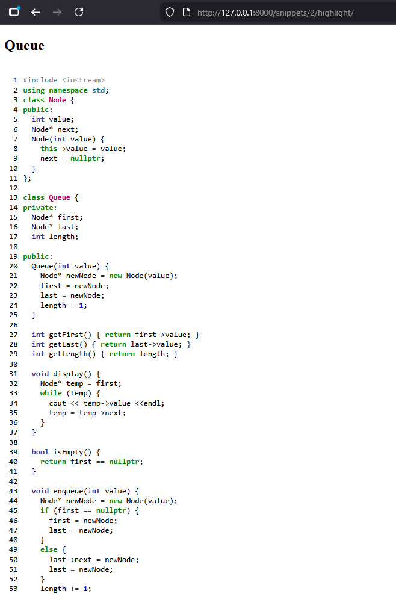

## Pastebin API

A RESTful Pastebin-like API built with **Django REST Framework**, where users can create, view, and share code snippets with syntax highlighting.

Code syntax highlighting is powered by **Pygments**, integrated into the API's HTML render endpoint.

### Snippet Highlight

- HTML-rendered syntax-highlighted code for a single snippet.

